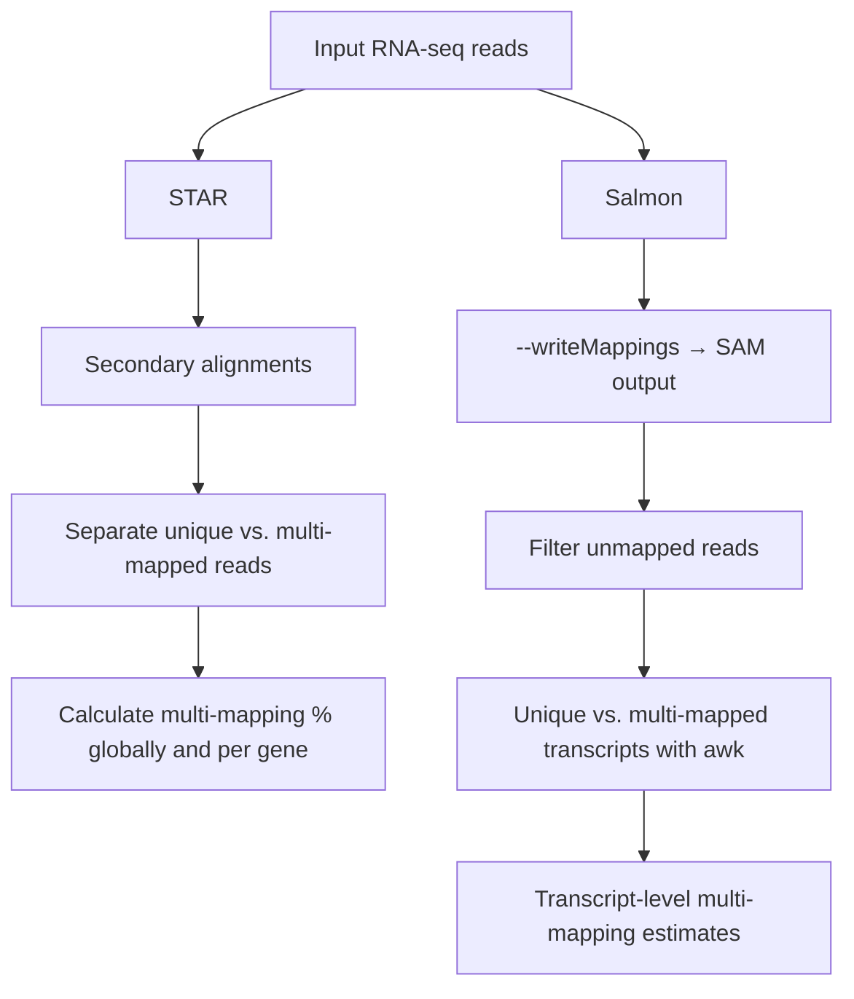

# Benchmarking RNA-seq

This repository provides a practical workflow to explore and benchmark RNA-seq data analysis.  
It includes scripts and guidelines for key steps such as:

- ✨ **UTR annotation** (if not available in the reference genome).  
- 📊 **Multi-mapping analysis** (for STAR+Salmon and Salmon).
- 🧬 **Quantification strategies** with selected parameters:  
  - `STAR + Salmon`  
  - `Salmon`  
  - `Kallisto`  
- 🧪 *(Optional, second stage)* Scripts to perform **simulation experiments** to further evaluate quantification accuracy and biases.  

The goal is to provide a reproducible framework that can be adapted to different datasets,  
helping users understand the impact of mapping and quantification strategies on RNA-seq analysis.  

---
## The case of UTRs 

In many organisms, annotation files such as GFFs typically include untranslated regions (UTRs). However, in some cases these annotations are absent. Incorporating UTRs during read mapping can be particularly useful to reduce multi-mapping in highly conserved regions. To address this limitation, we explore different computational strategies to infer UTRs.

Several tools exist for UTR prediction, including **GETUTR** (Kim et al., 2015), [`UTRme`](https://github.com/sradiouy/UTRme) (Radío et al., 2018), **ExUTR** (Huang and Teeling, 2017), and **F3UTER** (Sethi et al., 2022). However, many of these are limited to specific organisms or depend on input formats that may not be available for non-model organisms. More recently, [`peaks2utr`](https://github.com/haessar/peaks2utr) (Haese-Hill et al., 2023) has been introduced as an organism-independent option for UTR prediction.

### Requirements
- **GFF/GTF annotation file** (with or without existing 3′ UTR annotations)  
- Either:
  - **RNA-seq FASTQ files** (for quality assessment), or  
  - **BAM file** with aligned reads (depending on the selected tool)  

> **Note:** Some organisms, such as *Trypanosoma cruzi*, do not provide GTF files. In such cases, [`gffread`](https://github.com/gpertea/gffread) can be used to generate a GTF from the reference genome and its corresponding GFF.

### Next steps
After selecting the appropriate tool, integrate the predicted UTR coordinates into the original GFF annotation file.

---
## How much multi-mapping does my organism possess?

During read mapping, multi-mapping reads (i.e., reads that align to multiple genomic locations) can pose a challenge, depending on how each program handles them. Therefore, it is crucial to assess how difficult our organism of interest may be in this regard, particularly when working with short reads.  

To address this, we applied different strategies with two widely used tools in the community:  

---

### STAR
-Multi-mapping reads were detected based on secondary alignments.

-Reads were then classified as either uniquely mapped or multi-mapped according to alignment flags and mapping quality scores.

-The percentage of multi-mapped reads was calculated as the proportion of multi-mapped reads over the total number of mapped reads, both at the global and gene-specific levels.

To streamline this process, we developed a script to automate the classification and computation.
The script's name is: Multi-mapping:STAR.sh

> [!NOTE]
> To execute it, don´t forget to run previosly: chmod +x

This script runs a full pipeline with **STAR**, **samtools**, and **featureCounts** to calculate the percentage of multimapped reads per gene. It is designed to be user-friendly and can be run either with parameters or interactively.

---

## 📋 Requirements

Make sure you have the following tools installed and accessible in your `$PATH`:

- [STAR](https://github.com/alexdobin/STAR)  
- [samtools](http://www.htslib.org/)  
- [Subread (featureCounts)](https://subread.sourceforge.net/)  
- `awk` and `join` (standard in most Linux distributions)  

---

## Usage

```bash
./Multi-mapping:STAR.sh -g <GENOME_INDEX> -a <ANNOTATION> -i <INPUT_DIR> -o <OUTPUT_DIR> -t THREADS

```
> [!IMPORTANT]
>📌 Required parameters
>-g : Path to the STAR genome index directory
> 
>-a : Path to the annotation file (GTF/GFF)
> 
>-i : Path to the directory containing input reads (*_1.fasta / *_2.fasta)
> 
>-o : Path to the output directory

⚙️ Optional parameters

-t : Number of threads to use (default = 8)

-h : Show help message

---

### Salmon
To obtain transcript-level counts from Salmon, the `--writeMappings` parameter was used to generate a SAM file.  

### Workflow Overview


---
## Quantification strategies


---
## Optional: Simulation in RNAseq 

