# Benchmarking RNA-seq

This repository provides a practical workflow to explore and benchmark RNA-seq data analysis.  
It includes scripts and guidelines for key steps such as:

- ✨ **UTR annotation** (if not available in the reference genome).  
- 📊 **Multi-mapping analysis** (for STAR+Salmon and Salmon).
- 🧬 **Quantification strategies** with selected parameters:  
  - `STAR + Salmon`  
  - `Salmon`  
  - `Kallisto`  
- 🧪 *(Optional, second stage)* Scripts to perform **simulation experiments** to further evaluate quantification accuracy and biases.  

The goal is to provide a reproducible framework that can be adapted to different datasets,  
helping users understand the impact of mapping and quantification strategies on RNA-seq analysis.  

---
## The case of UTRs 

In many organisms, annotation files such as GFFs typically include untranslated regions (UTRs). However, in some cases these annotations are absent. Incorporating UTRs during read mapping can be particularly useful to reduce multi-mapping in highly conserved regions. To address this limitation, we explore different computational strategies to infer UTRs.

Several tools exist for UTR prediction, including **GETUTR** (Kim et al., 2015), [`UTRme`](https://github.com/sradiouy/UTRme) (Radío et al., 2018), **ExUTR** (Huang and Teeling, 2017), and **F3UTER** (Sethi et al., 2022). However, many of these are limited to specific organisms or depend on input formats that may not be available for non-model organisms. More recently, [`peaks2utr`](https://github.com/haessar/peaks2utr) (Haese-Hill et al., 2023) has been introduced as an organism-independent option for UTR prediction.

### Requirements
- **GFF/GTF annotation file** (with or without existing 3′ UTR annotations)  
- Either:
  - **RNA-seq FASTQ files** (for quality assessment), or  
  - **BAM file** with aligned reads (depending on the selected tool)  

> **Note:** Some organisms, such as *Trypanosoma cruzi*, do not provide GTF files. In such cases, [`gffread`](https://github.com/gpertea/gffread) can be used to generate a GTF from the reference genome and its corresponding GFF.

### Next steps
After selecting the appropriate tool, integrate the predicted UTR coordinates into the original GFF annotation file.

---
## How much multi-mapping does my organism possess?

During read mapping, multi-mapping reads (i.e., reads that align to multiple genomic locations) can pose a challenge, depending on how each program handles them. Therefore, it is crucial to assess how difficult our organism of interest may be in this regard, particularly when working with short reads.  

To address this, we applied different strategies with two widely used tools in the community:  

---

### STAR
-Multi-mapping reads were detected based on secondary alignments.

-Reads were then classified as either uniquely mapped or multi-mapped according to alignment flags and mapping quality scores.

-The percentage of multi-mapped reads was calculated as the proportion of multi-mapped reads over the total number of mapped reads, both at the global and gene-specific levels.

To streamline this process, we developed a script to automate the classification and computation.
The script's name is: **Multi-mapping:STAR.sh**

> [!NOTE]
> To execute it, don´t forget to run previosly: chmod +x

This script runs a full pipeline with **STAR**, **samtools**, and **featureCounts** to calculate the percentage of multimapped reads per gene. It is designed to be user-friendly and can be run either with parameters or interactively.

---

## 📋 Requirements

Make sure you have the following tools installed and accessible in your `$PATH`:

- [STAR](https://github.com/alexdobin/STAR)  
- [samtools](http://www.htslib.org/)  
- [Subread (featureCounts)](https://subread.sourceforge.net/)  

---

## Usage

```bash
./Multi-mapping:STAR.sh -g <GENOME_INDEX> -a <ANNOTATION> -i <INPUT_DIR> -o <OUTPUT_DIR> -t THREADS

```
> [!IMPORTANT]
>📌 Required parameters
> 
>-g : Path to the STAR genome index directory
> 
>-a : Path to the annotation file (GTF/GFF)
>
>-1   Reads 1 FASTQ file
> 
>-2   Reads 2 FASTQ file
> 
>-o : Path to the output directory

⚙️ Optional parameters

-t : Number of threads to use (default = 8)

-h : Show help message


---

## Salmon
To obtain transcript-level counts from **Salmon**, the `--writeMappings` parameter was used to generate a SAM file containing all alignments.  
From this file, unique and multi-mapping reads were separated, and transcript counts were calculated as follows:

### Separate unique and multi-mapping reads

### Extract read IDs
```bash
awk '!/^@/ {count[$1]++} END {for (id in count) if (count[id] == 1) print id}' ${SAMPLE_OUT}_all_mappings.sam > ${SAMPLE_OUT}_unique_ids.txt
awk '!/^@/ {count[$1]++} END {for (id in count) if (count[id] > 1) print id}' ${SAMPLE_OUT}_all_mappings.sam > ${SAMPLE_OUT}_multi_ids.txt

```
### Create SAM files
```bash
grep -Ff ${SAMPLE_OUT}_unique_ids.txt ${SAMPLE_OUT}_all_mappings.sam > ${SAMPLE_OUT}_unique.sam
grep -Ff ${SAMPLE_OUT}_multi_ids.txt ${SAMPLE_OUT}_all_mappings.sam > ${SAMPLE_OUT}_multi.sam
```

### Count transcripts
```bash
awk -F'\t' '$3 != "*" {count[$3]++} END {for (t in count) print t, count[t]}' ${SAMPLE_OUT}_unique.sam > ${SAMPLE_OUT}_unique_counts.txt
awk -F'\t' '$3 != "*" {count[$3]++} END {for (t in count) print t, count[t]}' ${SAMPLE_OUT}_multi.sam > ${SAMPLE_OUT}_multi_counts.txt

```
### Sort counts
```bash

sort ${SAMPLE_OUT}_unique_counts.txt > ${SAMPLE_OUT}_unique_sorted.txt
sort ${SAMPLE_OUT}_multi_counts.txt > ${SAMPLE_OUT}_multi_sorted.txt
 ```

### Calculate percentage of multi-mapping reads per transcript
Finally, the unique and multi-mapping transcript counts were merged using the `join` command. For each transcript, the percentage of multi-mapping reads relative to the total (unique + multi) was calculated with `awk`, and the results were saved into a CSV file.

---

## Bowtie2 

Although Bowtie 2 is not always the most recommended option for organisms with highly repetitive genomes, it is still possible to track and analyze multi-mapping reads.

To properly assess multi-mapping, it is essential to enable the -k parameter, which instructs Bowtie2 to report multiple valid alignments per read (when they exist). Without this parameter, only one alignment per read will be reported, potentially underestimating multi-mapping levels.

### _Using XS:i Tag_ 

### Extract multi-mapping reads
```bash
samtools view -h sample_sorted.bam \
| awk '$0 ~ /^@/ || $0 ~ /XS:i:[0-9]+/' \
| samtools view -Sb - \
> multimapping_reads.bam
```

### Extract unique reads
```bash
samtools view -h sample_sorted.bam \
| awk '$0 ~ /^@/ || ($0 !~ /XS:i:[0-9]+/ && $1 !~ /^@/)' \
| samtools view -Sb - \
> unimapping_reads.bam
```
---

## Summary

```mermaid
flowchart TD
    A[Input RNA-seq reads] --> B[STAR]
    A --> C[Salmon]

    B --> B1[Secondary alignments]
    B1 --> B2[Separate unique vs. multi-mapped reads]
    B2 --> B3[Calculate multi-mapping % globally and per gene]

    C --> C1[--writeMappings → SAM output]
    C1 --> C2[Filter unmapped reads]
    C2 --> C3[Unique vs. multi-mapped transcripts with awk]
    C3 --> C4[Transcript-level multi-mapping estimates]


```


---
## Quantification Strategies

To evaluate the impact of different mapping and quantification strategies on **gene expression estimates in *T. cruzi***, we implemented three main pipelines:  

- **STAR + Salmon (alignment-based mode)**  
- **Salmon (quasi-mapping mode)**  
- **Kallisto (pseudo-alignment mode)**  

All reads were mapped or quantified against the *T. cruzi* YC6 reference genome and transcriptome (Wang et al., 2021). Parameters were adjusted to account for the complex genome architecture of *T. cruzi*.  

---

### 1. STAR + Salmon (alignment-based mode)

This strategy combines **STAR** for alignment and **Salmon** for transcript quantification.  
Paired-end reads are first mapped to the genome, producing both sorted BAM files and transcriptome alignments.  
These alignments are then passed to Salmon in alignment-based mode.

**Key parameters (STAR):**
- Allow multiple mappings per read: `--outFilterMultimapNmax 50`  
- Adapt splice junction detection:  
  `--outSJfilterReads Unique`  
  `--outSJfilterOverhangMin 150 150 150 150`  
  `--outFilterType BySJout`  
- Mismatch filtering: `--outFilterMismatchNoverReadLmax 0.01`  
- End-to-end alignment: `--alignEndsType EndToEnd`  
- Output sorted BAM files: `--outSAMtype BAM SortedByCoordinate`  
- Output transcriptome alignments: `--quantMode TranscriptomeSAM`  

**Salmon (alignment-based mode):**
- Input: transcriptome-aligned BAM files from STAR  
- Run with default parameters  

---

### 2. Salmon (quasi-mapping mode)

This strategy uses **Salmon** directly with its **quasi-mapping algorithm**, without prior genome alignment.  

**Steps:**
1. Index the genome and GTF annotation.  
2. Run Salmon with paired-end reads.  

**Key parameters:**
- Automatic library type detection: `-l A`  
- Enable improved mapping validation: `--validateMappings`  
- Default parameters for quantification  

---

### 3. Kallisto (pseudo-alignment mode)

This strategy uses **Kallisto** for fast quantification through pseudo-alignment.  
Reads are aligned against the *T. cruzi* transcriptome FASTA.  

**Steps:**
1. Build Kallisto index from transcript FASTA.  
2. Run Kallisto with paired-end reads.  

**Key parameters:**
- Default pseudo-alignment settings  
- Input: transcriptome FASTA  

---

📌 **Note:** All commands should be adapted to your file paths and computational environment. The provided parameters are optimized for the *T. cruzi* genome, which is highly repetitive and requires careful handling of multi-mapping reads.

---
## Simulations with Polyester

If you want to perform different RNA-seq simulations, we highly recommend using the [**Polyester**](https://github.com/alyssafrazee/polyester) R package.  

### Requirements
To run this pipeline, you will need:  
- A **CSV file** containing the gene IDs and the expected number of reads for each gene.  
- A **FASTA file** with the genome sequences and their corresponding IDs.  

### Example
Below we provide an example R script (_Simulation_example.R_) to run a simulation experiment with Polyester.  
⚠️ Remember to replace all file paths in the script with the paths to your own input files.  


```r
################### Simulation in RNA-seq ######################

################### 1. Install packages ########################
if (!requireNamespace("BiocManager", quietly = TRUE))
  install.packages("BiocManager")
BiocManager::install("polyester")

library(polyester)
library(Biostrings)

################### 2. Load CDS FASTA ##########################
CDS_fasta <- readDNAStringSet(filepath = "FASTAPATH")
writeXStringSet(CDS_fasta, "CDS.fasta")

################### 3. Load read counts table ##################
tabla_epi <- read.csv("TABLEPATH.CSV", sep = ",")

################### 4. Prepare counts ##########################
conteos_epi <- cbind.data.frame(tabla_epi$target_id, tabla_epi$est_counts)
colnames(conteos_epi) <- c("gene_ID", "est_counts")

# Example: use est_counts directly (can be scaled if needed)
conteos_epi$cant_lecturas <- round(conteos_epi$est_counts, 0)

################### 5. Create count matrix #####################
countmat_epis <- matrix(conteos_epi$cant_lecturas,
                        nrow = length(CDS_fasta), ncol = 1)

write.csv(conteos_epi, "NEWTABLEPATH")

################### 6. Run simulation ##########################
simulate_experiment_countmat("CDS.fasta",
                             readmat = countmat_epis,
                             outdir = "OUTPUTPATH.FASTA")

```

> [!NOTE]
> 
> -Replace FASTAPATH, TABLEPATH.CSV, NEWTABLEPATH, and OUTPUTPATH.FASTA with the correct paths in your system.
>
> -The column est_counts should represent the expected number of reads for each transcript.
>
> -You can scale the counts if you want to simulate different sequencing depths (e.g., multiply est_counts by a factor).

### Comparative overview of strategies for handling multi-mapping reads in RNA-seq

#### Bulk RNA-seq approaches

| Tool / Approach                                     | Type                              | Pros                                                                                                        | Cons                                                                                                                    | Recommended scenarios                                                                    |
| --------------------------------------------------- | --------------------------------- | ----------------------------------------------------------------------------------------------------------- | ----------------------------------------------------------------------------------------------------------------------- | ---------------------------------------------------------------------------------------- |
| **Bowtie2 + featureCounts**                         | Alignment-based                   | Mature, widely used; generates alignments; flexible parameterization                                        | Retains many multimappers → inflated counts in repetitive regions; poor paralog resolution                              | Legacy workflows; need for BAM alignments; exploratory analyses                          |
| **STAR + featureCounts**                            | Alignment-based                   | Fast splice-aware aligner; widely supported; used in Cell Ranger; flexible parameters                       | Handling of multimappers depends on settings; often discards or ambiguously assigns; sensitive to incomplete annotation | Large-scale alignment pipelines; downstream analyses requiring BAMs or junctions         |
| **STAR + Salmon (hybrid)**                          | Hybrid alignment + quantifier     | Keeps alignments while benefiting from probabilistic quantification; good compromise between speed/accuracy | Sensitive to annotation quality; heavier computational burden than pure Salmon                                          | When alignments are required (QC, variant calling) but accurate quantification is needed |
| **Salmon**                                          | Alignment-free (quasi-mapping)    | High accuracy; probabilistic assignment of multimappers; fast and memory-efficient                          | No full BAM alignments; cannot resolve perfect duplicates; sensitive to incomplete transcript models                    | General-purpose quantification; repetitive genomes with extended annotations             |
| **Kallisto**                                        | Alignment-free (pseudoalignment)  | Extremely fast; good accuracy at transcript level; low resource requirements                                | Less flexible than Salmon; weaker handling of some biases; limited diagnostics                                          | Transcriptome-wide quantification; exploratory analyses at scale                         |
| **MMquant**                                         | Alignment-based read reassignment | Redistributes multimappers across compatible features → maximizes data usage                                | Risk of overestimation in pseudogenes/poorly resolved paralogs; less adopted                                            | Multigene family studies where coverage retention is critical                            |
| **STARconsensus**                                   | Alignment-based (haplotype-aware) | Allows haplotype-specific reference transformation; supports consensus genomes                              | Complex setup; not widely adopted; limited tools downstream                                                             | Studies with divergent haplotypes; allele-specific expression                            |
| **Graph-based pangenomes (vg, Giraffe, minigraph)** | Graph aligners                    | Reduces reference bias; integrates haplotypes/structural variants; handles diversity                        | Still experimental in RNA-seq; complex to implement; computationally intensive                                          | Future-proof for highly polymorphic/repetitive species; pangenome projects               |

---

#### Single-cell RNA-seq approaches

| Tool / Approach                | Type                                     | Pros                                                                                               | Cons                                                                                     | Recommended scenarios                                                      |
| ------------------------------ | ---------------------------------------- | -------------------------------------------------------------------------------------------------- | ---------------------------------------------------------------------------------------- | -------------------------------------------------------------------------- |
| **Cell Ranger (10x)**          | Single-cell pipeline (STAR-based)        | Industry standard; robust UMI handling; reproducible outputs; discards multimappers conservatively | Underestimates expression of repetitive gene families; STAR dependency; black-box nature | Routine 10x scRNA-seq; clinical/industry-grade analyses                    |
| **STARsolo**                   | Single-cell aligner (STAR-based)         | Transparent STAR-based pipeline; customizable multimapper handling                                 | Same multimapping limitations as STAR; heavier resource use                              | Alternative to Cell Ranger; when flexibility is needed in scRNA-seq        |
| **Salmon-Alevin / Alevin-fry** | Single-cell quantifier (alignment-free)  | Efficient UMI-aware quantification; probabilistic handling of multimappers; lower memory footprint | Relatively new; fewer downstream wrappers than Cell Ranger                               | scRNA-seq with focus on quantification accuracy; repetitive transcriptomes |
| **Kallisto + bustools**        | Single-cell quantifier (pseudoalignment) | Extremely fast; modular and memory-efficient; widely benchmarked                                   | Requires careful pre-processing; less user-friendly                                      | scRNA-seq at scale where speed and modularity are critical                 |


